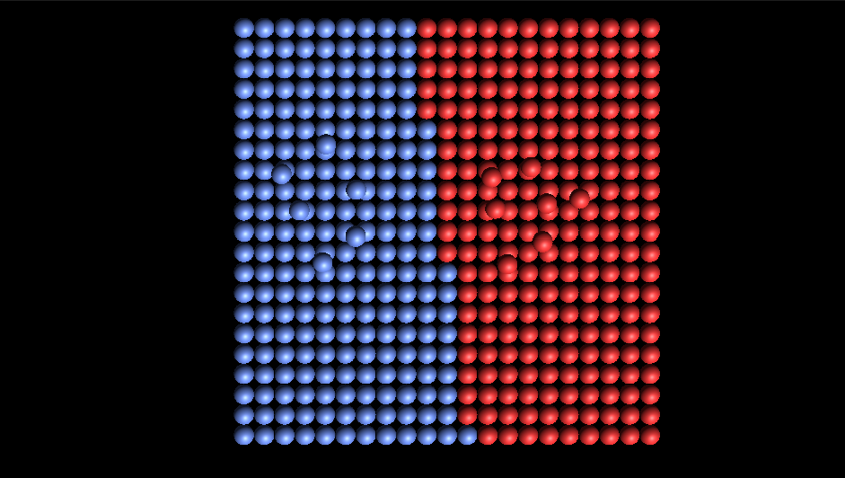
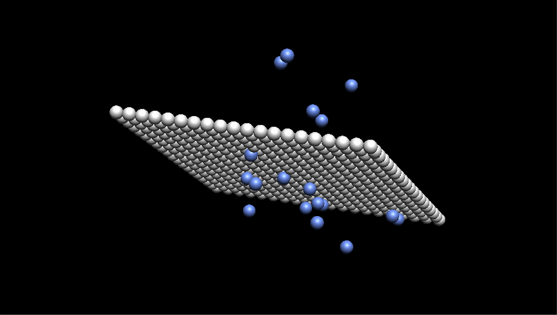

# Linear model and multi layer perceptron (MLP)

## Classification
* [Unity_dll/Unity_dll/Source.cpp#L64](Unity_dll/Unity_dll/Source.cpp#L64)

## Regression
* [Unity_dll/Unity_dll/Source.cpp#L33](Unity_dll/Unity_dll/Source.cpp#L33)

