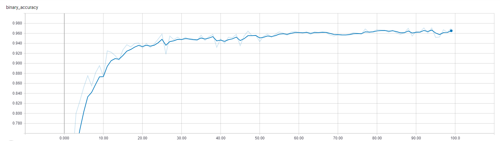
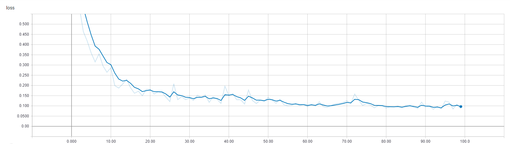

# Keras Logs Report

## Dataset

From keras

### Accuracy provided

| Algo                              | Result        |
| --------------------------------- |:-------------:|
| Baseline (always predict male)    | 50% / 50%     |
| Logistic Regression               | 97% / 98%     |
| CART                              | 96% / 97%     |
| Random Forest                     | 100% / 98%    |
| SVM                               | 100% / 99%    |
| XGBoost                           | 100% / 99%    |

## Multi Layer Perceptron Classification (MLP)

### Tanh

#### 4 layer 4096 outputs

* epochs = 200
* validation_split = 0.2
* batch_size = 32
* optimizer = sgd(0.001, momentum=0.9)

### Relu

#### 4 layer 4096 outputs

* epochs = 100
* validation_split = 0.2
* batch_size = 32
* optimizer = adam()

