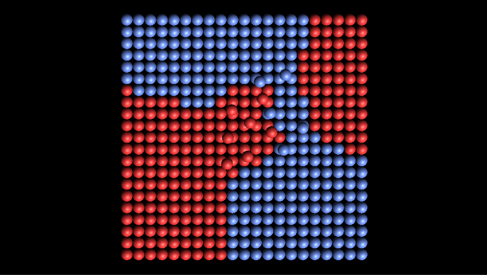

# ML Etape 4

https://github.com/rypall/pa2018

## Projet de démonstration et sources

> cf: pa2018\part2\part2_unity

### RBF Naïf

### Notebook

* [Keras notebook](./Keras/KerasMLPClassification.ipynb)
* [Lib notebook](./Keras/LibLinearClassification.ipynb)

### Début de la partie 2 du rapport

* [Rapport](./MLtoolbox.md)