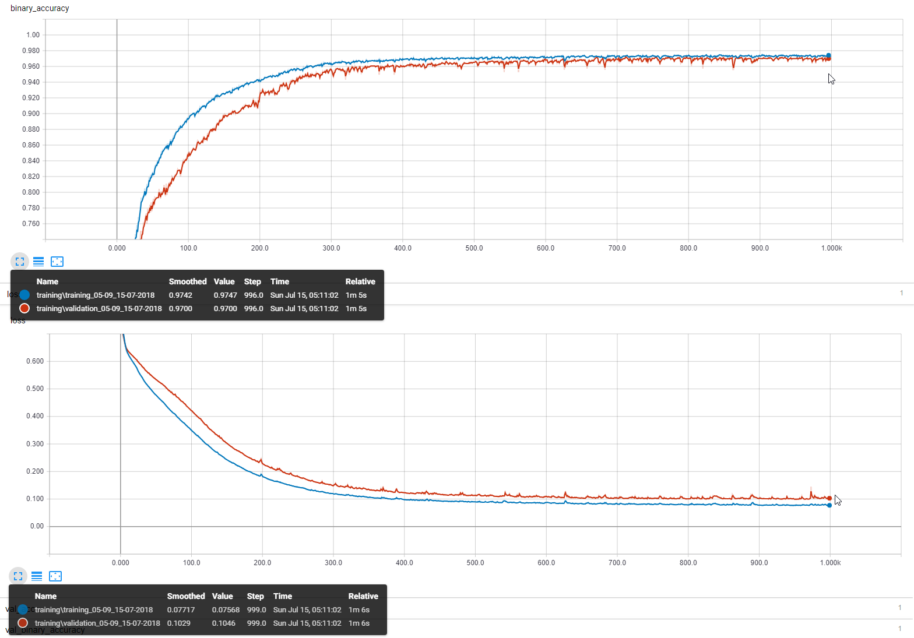
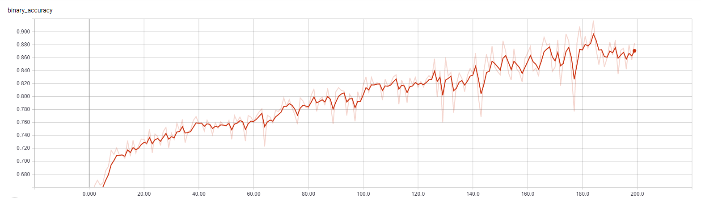
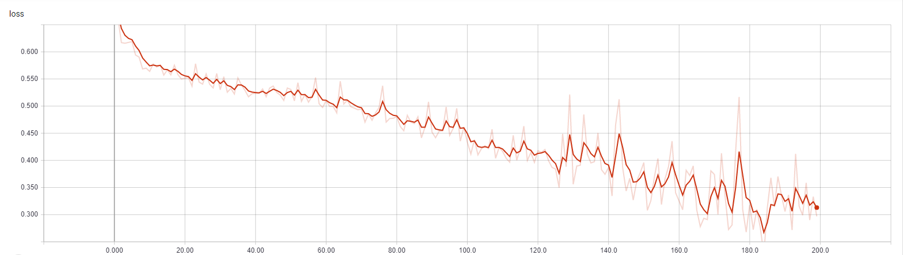
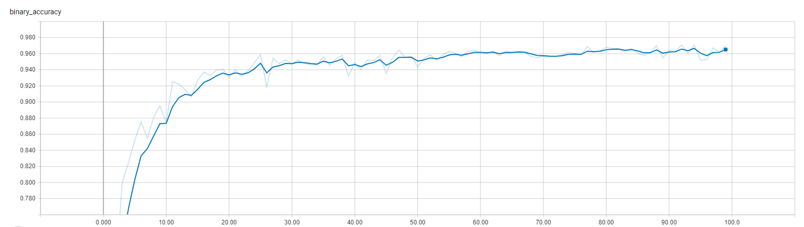
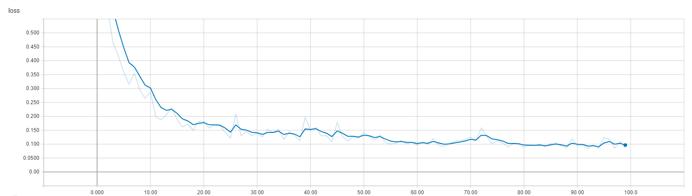

# ML Toolbox Etape 2

## tl;dr

* RBF Basique 100% (implem dll)
* RBF avec k means (LLoyds) 20% (implem consoleApp)
* SVM avec noyau radial * 0%

## Présentation du Dataset choisi

> link: https://www.kaggle.com/primaryobjects/voicegender/home

A partir de mesure récolté sur des enregistrements de voix prédire le genre.

## Présentation du protocole de test

* Resultat fournis par dans la description kaggle

| Algo                              | Result        |
| --------------------------------- |:-------------:|
| Baseline (always predict male)    | 50% / 50%     |
| Logistic Regression               | 97% / 98%     |
| CART                              | 96% / 97%     |
| Random Forest                     | 100% / 98%    |
| SVM                               | 100% / 99%    |
| XGBoost                           | 100% / 99%    |

### Objectif: vérifier et réussir à reproduire ces resultats

* Minimiser le loss sur le dataset de train pour généraliser sur le dataset de test.
* Maximiser la binary_accuracy sur les dataset train/test à > 95%

## Présentation du/des modèles testés

* Classification Linéaire
* MLP Classification

## Présentation des résultats obtenus

> cf: pa2018/part3/Kera/logs/

* MLP Resulta opti
* dense = 2*64
* dropout = 0.5
* activation = relu
* epochs = 1000
* validation_split = 0.2
* batch_size = 128
* loss = binary_crossentropy
* optimizer = rmsprop()



* MLP test overfitting

__4 layer 4096 outputs__

* activation = Tanh
* epochs = 200
* validation_split = 0.2
* batch_size = 32
* optimizer = sgd(0.001, momentum=0.9)




* activation = relu
* epochs = 100
* validation_split = 0.2
* batch_size = 32
* optimizer = adam()





### Notebook

* [Keras notebook](./Keras/KerasMLPClassification.ipynb)
* [Lib notebook](./Keras/LibLinearClassification.ipynb)

### Script

* [_keras.py](./Keras/_keras.py)
* [keras_linear_classif.py](./Keras/keras_linear_classif.py)
* [lib.py](./Keras/lib.py)

## QuickStart

## Start tensorflow backend

```console
λ activate tensorflowLatest
```

## Start jupyter noteboob

```console
λ jupyter notebook
```

## Start tensorboard

```console
λ tensorboard --logdir=result:./Keras/logs/
```
